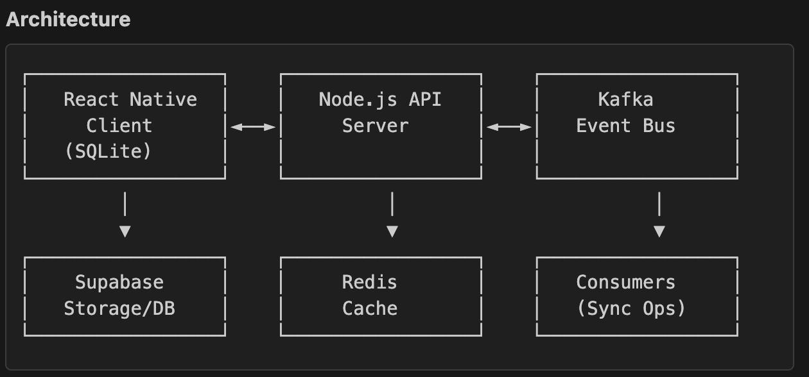

# AssetMapping Backend

Backend service for the Asset Mapping application, handling sync operations, validation, image processing, and event streaming.


## Features

- **Sync Service**: Handles offline-first synchronization with idempotency
- **Image Processing**: Secure image upload via signed URLs
- **Validation**: Server-side business logic and data validation
- **Event Streaming**: Kafka-based event publishing for audit logs and async processing
- **Idempotency**: Redis-based idempotency tracking (prevents duplicate operations)
- **Security**: Service-role Supabase access, rate limiting, and CORS protection

## Tech Stack

- **Runtime**: Node.js with TypeScript
- **Framework**: Express.js
- **Database**: Supabase (PostgreSQL)
- **Cache**: Redis (idempotency tracking)
- **Message Queue**: Kafka (event streaming)
- **Logging**: Winston

## Architecture

This backend acts as an intermediary between the mobile app and Supabase:

```
Mobile App → Backend API → Supabase Database
                ↓
          Redis (idempotency)
          Kafka (events)
```

Benefits:

- Centralized business logic
- Idempotent operations
- Event-driven architecture
- Better observability
- Enhanced security

## Getting Started

### Prerequisites

- Node.js 18+
- Docker and Docker Compose (for Redis and Kafka)
- Supabase project with service role key

### Quick Start

```bash
# Install dependencies
npm install

# Copy environment variables
cp .env.example .env

# Edit .env with your Supabase credentials
nano .env

# Start Redis and Kafka
docker-compose up -d

# Start the backend
npm run dev
```

Verify it's running:

```bash
curl http://localhost:3000/health
```

📖 **[Full Setup Guide](docs/SETUP.md)**

# Build for production

npm run build

# Run production build

npm start

```

### Environment Variables

See `.env.example` for required environment variables.

## API Endpoints

### Health Check

- `GET /health` - Server health status

### Sync Operations

- `POST /api/sync/item` - Sync a single item (pin or form) with idempotency

### Image Operations

- `POST /api/images/signed-url` - Get signed URL for image upload
- `POST /api/images/process` - Process and resize uploaded image

### Forms

- `POST /api/forms/validate` - Validate form data
- `POST /api/forms` - Create/update form with validation

### Pins

- `POST /api/pins/validate` - Validate pin data
- `POST /api/pins` - Create/update pin with validation

## Architecture

```

src/  
├── server.ts # Express app entry point  
├── config/ # Configuration (Redis, Kafka, Supabase)  
├── controllers/ # Request handlers  
├── services/ # Business logic  
│ ├── sync/ # Sync operations  
│ ├── validation/ # Data validation  
│ ├── images/ # Image processing  
│ └── idempotency/ # Idempotency tracking  
├── middleware/ # Express middleware  
├── routes/ # API routes  
├── types/ # TypeScript types  
└── utils/ # Helper functions  

```

## Migration from Frontend

The following logic has been migrated from the frontend:

1. **Supabase Direct Access**: All direct Supabase writes now go through backend
2. **Image Processing**: Image upload, resizing, and storage management
3. **Validation**: Form and pin validation logic
4. **Idempotency**: Server-side idempotency tracking with Redis
5. **Event Publishing**: Kafka events for sync operations

## Security

- Service role keys stored server-side only
- Rate limiting on all endpoints
- CORS configuration for allowed origins
- Input validation with Zod
- Helmet.js security headers

## License

MIT
```
